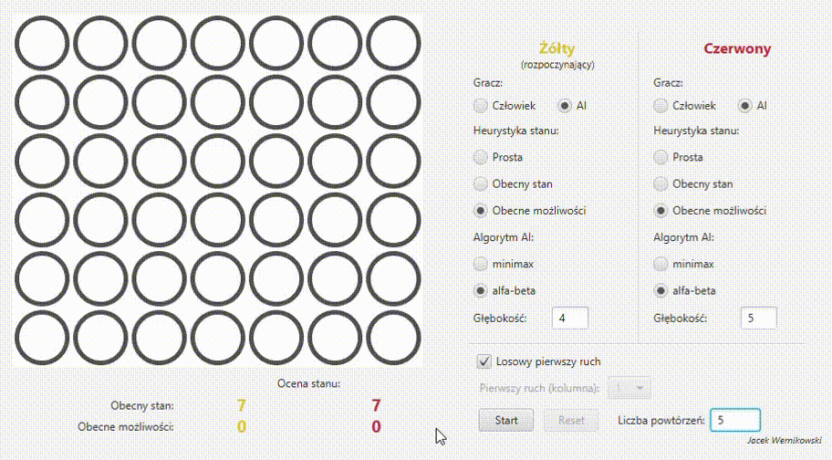
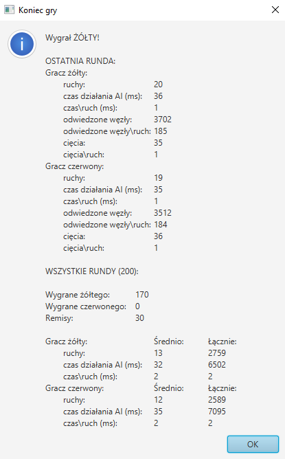

# Connect 4 AI
[Polski](./README.md)
## Introduction
This repository contains the source code of an implementation of [_Connect 4_](https://en.wikipedia.org/wiki/Connect_Four) game. The application was created using the Java language and the JavaFX library used for creating user interface. Artificial intelligence used by computer players was implemented using minimax ang alpha-beta algorithms and three proposed game state heuristics. The application allows: 
* Playing a game with two human players
* Playing a game with a single human player versus a computer player
* Monitoring a game of two computer players
* A precise configuration of the computer players parameters (selecting the game state heuristic, selecting the AI algorithm, determining the explored game tree depth)
* Conducting an automatic series of up to several hundred games between computer players in order to measure the effectiveness and efficiency of the selected AI configurations

The app was created for the laboratory classes of the 'Artificial intelligence' course during my engineering studies.

## Application
Below are shown example usages of the application:
* Conducting a series of five games between computer players


* Displaying the results of a series of games - informations concerning effectiveness and efficiency of each computer player



## Running
The built application is available on the repository page as a .jar file. After [downloading it](https://github.com/werekkk/connect4-ai/releases/tag/v0.1), it has to be executed from a command line using the command:

```java -jar connect4-ai-0.1.jar```

_Jacek Wernikowski_
