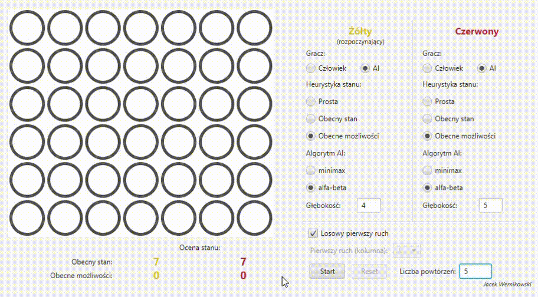

# Connect 4 AI
[English](./README-en.md)
## Wstęp
Repozytorium zawiera kod źródłowy aplikacji będącej implementacją gry [_Connect 4_](https://en.wikipedia.org/wiki/Connect_Four). Aplikację wykonano korzystając z języka Java i biblioteki JavaFX do stworzenia interfejsu użytkownika. Sztuczna inteligencja umożliwiająca grę przeciwnikowi komputerowymi jest zaimplementowana z wykorzystaniem algorytmów minimax i alphabeta, z trzema zaproponowanymi heurystykami oceny stanu gry. Aplikacja umożliwia:
* Rozgrywkę dwóch ludzkich graczy
* Rozgrywkę gracza ludzkiego z graczem komputerowym
* Śledzenie rozgrywki dwóch graczy komputerowych
* Dokładne skonfigurowanie parametrów gracza komputerowego (wybór heurystyki stanu, wybór algorytmu AI, określenie głębokości przeszukiwanego drzewa gry)
* Automatyczne przeprowadzenie serii nawet do kilkuset rozgrywek graczy komputerowych w celu pomiaru skuteczności i efektywności wybranych konfiguracji AI
 
Aplikację zrealizowano w ramach laboratorium kursu 'Sztuczna inteligencja' studiów inżynierskich.

## Aplikacja
Poniżej przedstawiono przykładowe użycie aplikacji:
* Przeprowadzenie serii pięciu rozgrywek pomiędzy graczami komputerowymi


* Wyświetlenie wyników serii rozgrywek - informacje na temat skuteczności i efektywności poszczególnych graczy komputerowych


## Uruchamianie
Zbudowana aplikacja została załączona do repozytorium jako plik .jar. Należy go [pobrać](https://github.com/werekkk/connect4-ai/releases/tag/v0.1) i uruchomić z wiersza poleceń komendą:

```java -jar connect4-ai-0.1.jar```

_Jacek Wernikowski_
